<h3>
<code>
nikhil@github ~ $ ./contributions.sh
</code>
</h3>

  

<h3>
<code>
nikhil@github ~ $ whoami
</code>
</h3>

<table>

<tr>

<td valign="top">

</td>

<td valign="top">

</td>

</tr>

</table>

 

<h3>
<code>
nikhil@github ~ $ projects
</code>
</h3>

<pre>

🚀 Gym Management System

MERN Stack
MongoDB
Express
React
Node.js

🤖 Resume AI Builder

React
Node.js
AI

🎵 Skipe Music App

React
Express
Redis

</pre>

<h3>
<code>
nikhil@github ~ $ skills
</code>
</h3>

<pre>

Languages:

Python
Java
C
JavaScript

Backend:

Node.js
Express
Redis

DevOps:

Docker
Linux
AWS

Learning:

DSA
System Design
Cloud

</pre>

